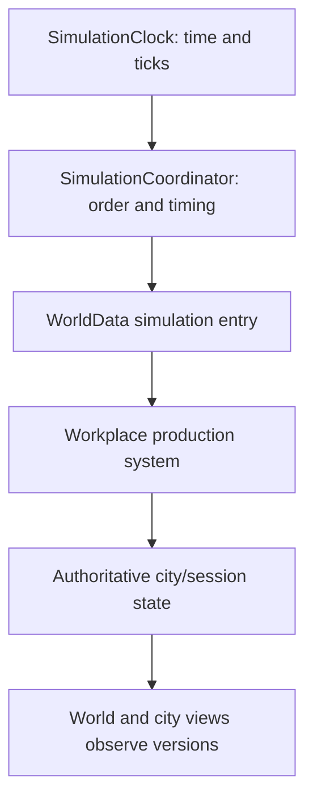
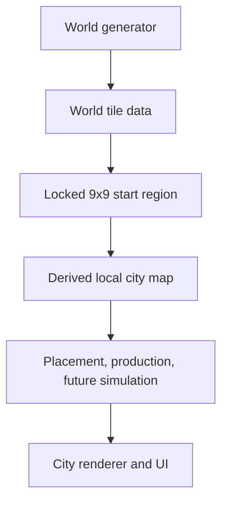

# Paladin Current State

This file is the living map of the current Paladin checkpoint. It distinguishes code present in the inspected snapshot from confirmed design that has not yet been implemented. It should be updated after meaningful phases, durable behavior changes, or architectural moves; it should not be rewritten for ordinary symbol renames.

## 1. Status Metadata

| Field | Value |
| --- | --- |
| Project | Paladin |
| Documentation revision | 2026-07-10, America/New_York |
| Godot project version | `0.0.1` in `project.godot` |
| Engine feature set | Godot 4.4, Forward Plus |
| Active language | GDScript |
| Inspected snapshot | Uploaded archive `paladin-game-main 3(1).zip`; embedded archive identifier `749144368c066f50073073e615bda03e6c32442b` |
| Snapshot date | Not independently known. Archive entries report 2026-07-11, but ZIP timestamps are packaging metadata and occur after the current local date; do not treat them as an authoritative commit date. |
| Code reviewed | Complete tree; `project.godot`; all active and temporary scenes; all 15 substantive `.gd` files, totaling 12,342 lines; current autoloads, entry scenes, and input handling |
| Historical sources reconciled | Current Paladin project context; confirmed July 6–10 conversation decisions; prior `Paladin_branch_handoff.txt`, `Paladin_next_phase_handoff.txt`, and `Paladin_phase_2C_branch_handoff.txt` facts recovered from project context |
| Runtime verification in this audit | Static inspection only. A Godot executable was not available in the workspace. User confirmations and the latest handoff identify the working checkpoint, but this documentation pass did not launch the game. |
| Confidence | High for repository structure, current code capabilities, and the immediate Phase 2C frontier; medium where only prior handoff/conversation evidence exists; explicitly low or unresolved items are labeled below. |

Warning: later manual chat edits can exist beyond any repository snapshot. Apply the source-priority rules in `AGENTS.md` before changing code.

### Status vocabulary

- **Working:** implemented and confirmed at the current checkpoint.
- **Working prototype:** implemented end to end, but intentionally narrow, in-memory, or not production-hardened.
- **Partial:** meaningful implementation exists, but an important part of the current contract is missing.
- **Scaffolded:** data fields, types, or policy shape exist without the behavior needed to complete the system.
- **Design defined:** behavior is accepted in project context but not materially implemented.
- **Not started:** neither meaningful behavior nor a sufficient scaffold exists.
- **Obsolete:** replaced or unused behavior that should not guide new work.
- **Needs verification:** code or historical evidence is ambiguous and requires a current Godot run or user decision.

## 2. Current Development Frontier

Paladin is at the end of Phase 2C's visible workplace-production work and immediately before Phase 2C production validation.

Most recently completed and confirmed:

- A persistent global simulation clock and simulation coordinator drive ordered ticks independently of scene renderers.
- Fishing Grounds are the first clock-driven workplace. Assigned living citizens contribute deterministic worker-time, production completes in whole fish batches, local workplace storage has real capacity, and production blocks when that storage is full.
- Workplace progress and output survive world/city scene transitions because active session state is retained globally in memory.
- The selected-workplace panel reports status, assigned and productive worker counts, worker names, output, progress, estimated hourly rate, site productivity, and local storage.
- The city resource bar reports aggregate amounts and capacity across eligible non-ground city-object containers. This intentionally includes Fishing Grounds storage and preserves separate public-Stockpile queries.
- Debug-only `=` and `-` keyboard zoom is implemented in the shared camera and therefore applies to both world and city views while global debug mode is enabled. Mouse-wheel zoom remains available normally.

The immediate next implementation is to finish Phase 2C by extending `CityStateValidator` for workplace definitions and runtime production state. This is deliberately an isolated validation patch: it should not change production behavior, UI, or resource rules.

The validator must add workplace-version cache invalidation and check recipe dictionaries, input/output resource entries, positive whole quantities, positive batch work, policy schemas and mode-specific fields, runtime progress bounds, recognized status, productive-worker bounds and consistency, nonnegative site productivity, and legal output storage. Structural violations are errors; transient derived differences should not be promoted to hard errors without a real invariant.

This work matters because Phase 2D will connect Fishing Grounds productivity to actual nearby fish-bearing tiles. Adding geometry-derived productivity on top of unvalidated definitions and stale validator caches would make failures difficult to localize. Phase 2C validation is the safety gate before environmental production sources, ground-pile overflow, schedules, needs, and logistics.

## 3. System Status Matrix

### Project, world, and city map

| System | Status | Current capability | Major dependencies | Known limitations | Next likely extension |
| --- | --- | --- | --- | --- | --- |
| Project boot and main menu | Working prototype | `MainMenu.tscn` is the default scene. A programmatic menu exposes Play, Exit, and a debug-build-only Dev City shortcut. Entering the menu suspends active simulation. | `project.godot`, `MainMenu.gd`, autoload clock, dev launcher | No save browser, settings, resume slot, or disk persistence. | Add real new/load game flows only after persistence design exists. |
| World generation | Working prototype | Seeded pipeline produces a 600×440 tile world with elevation, temperature, precipitation, terrain, biomes, rivers, fertility, and deposits. | `WorldGenerator`, `WorldData`, `MapSettings`, Godot noise | Tuning is prototype-level; generation state is in memory; no schema-versioned save. | Preserve while Phase 2 focuses on city simulation; revisit only with measured or design need. |
| Biome generation | Working prototype | Supports ocean, river, mountain, hills, desert, plain, forest, tundra, taiga, and jungle. | Elevation/climate fields, mountain score cache | Raw string identifiers and heuristic boundaries; no ecological simulation. | Add systems that consume biome meaning before expanding biome count. |
| Hills | Working | Hills form the outer/weaker mountain regions and use land terrain; dense peaks remain mountain biome/terrain. | Mountain scoring and peak-neighbor logic | Current thresholds are tuning, not durable contracts. | Protect biome/terrain distinction when adding extraction or movement costs. |
| Rivers | Working prototype | Generator carves paths from qualifying land sources to open ocean or existing rivers and marks river tiles as water/river. A simple valley-source heuristic and mountain penalties exist. | World elevation, biome assignment, open-ocean lookup | This is not the deferred fully intelligent valley-aware river system; paths remain heuristic. | Leave advanced valley routing deferred unless terrain work becomes the active priority. |
| World rendering | Working prototype | Renders cached map textures in six modes, an abyss background, hover inspection, region cursors, UI, and debug data. | `WorldRenderer`, `MapVisuals`, `MapTextureCache`, `WorldData` | Current script also coordinates generation and save locking, so it is not a pure renderer. | Keep new simulation behavior outside it; split coordination only at a stable boundary. |
| World selection | Working | Player selects a 9×9 starting region. A region is invalid only when more than 90% is ocean or it falls outside the map; rivers are exempt. Invalid preview is red and selected region is cyan. | World data, renderer input, region geometry | One starting region and one locked official world per runtime session. A log string still says “ocean/river” although code counts ocean only. | Preserve rule; correct stale wording during a nearby focused edit. |
| City-map derivation | Working prototype | The selected 9×9 world region is deep-copied and expanded to a 576×576 local map using interpolation, noise warping, local biome edges, fertility detail, coasts, and resource sampling. | Stored start region, `CityRenderer`, `WorldData`, map settings | Generation currently lives in the city renderer/controller; no independent city-map generator service. | Move only when city-domain boundaries stabilize; Phase 2D will query this map for source tiles. |
| City view | Working prototype | Loads or builds the active city map, restores city camera state, creates UI/debug controls, resumes simulation, and allows return to the world. | `CityScreen.tscn`, `CityRenderer`, runtime session state | Single active city; all state is process-memory only. | Build simulation depth before multi-city navigation. |
| City rendering | Working prototype | Draws terrain texture, buildings, roads, selection, hover, placement previews, debug labels, and road previews. Six map modes share visual rules with world view. | `CityRenderer`, `MapVisuals`, `MapTextureCache`, state versions | Very large mixed-responsibility script; redraw and UI coupling remain regression risks. | Avoid unrelated split during Phase 2C; extract stable domains later. |

### City objects, resources, and economy

| System | Status | Current capability | Major dependencies | Known limitations | Next likely extension |
| --- | --- | --- | --- | --- | --- |
| City founding | Working | Placing the City Keep founds the city, records foundation geometry, creates the starting population, and unlocks building. Foundation recovery protects scene transitions. | City-object definitions, placement, city state, citizens | Fixed default name “First City”; one player city; no political owner model beyond a string. | Keep stable through production work; later generalize identity for multiple cities/empires. |
| City state | Working prototype | Central runtime state tracks official world/city maps, city identity, objects, occupancy, citizens, assignments, storage, version counters, cameras, caches, and scene paths. | Static `WorldData` state and helper operations | Broad global ownership, one-session assumptions, no serialization, and direct dictionary exposure. | Harden invariants first; split state ownership incrementally when domains stabilize. |
| Building placement | Working prototype | Data-driven definitions support centered previews, repeat placement, terrain/bounds/occupancy checks, footprints, placement effects, rendering, and inspection. | City map, object definitions, occupancy, `CityRenderer` | Authoritative add operations rely partly on caller validation; no removal, cost, construction time, or rotation. | Add only behavior required by the active production/logistics phases. |
| Roads | Working prototype | Player drags a rectangle of valid tiles, releases to make a preview, then clicks again to confirm. A road object stores an arbitrary tile list and occupies those tiles. | City input, placement validation, city objects, rendering | Roads are not selectable and do not affect pathfinding or travel; no delete or connectivity validation. | Consume road tiles in Phase 2M movement/pathfinding. |
| City Keep | Working prototype | Founding object and city information anchor; shows population, housed count, and unemployment. | City founding, citizen state | No administrative, storage, political, or defensive mechanics. | Expand only when later city/empire systems need it. |
| Houses | Partial | Houses have resident capacity, track resident IDs, auto-fill homeless citizens, and appear in inspection. They are tagged as private-home containers conceptually. | Citizen assignments, object definitions, validator | At this snapshot they allow no resource types and have no storage capacity, so private storage contributes zero to aggregate totals. | Define actual household storage and food demand in later inventory/access/household phases. |
| Stockpiles | Working prototype | A Stockpile stores fish, coal, iron, and gold in independent bounded quantities, exposes local contents, counts as public storage, and can receive debug resource injection. | Container API, city objects, UI, debug input | No hauling, access permissions, stockpile balancing, filters, or construction cost. | Become preferred logistics destinations after task/reservation foundations. |
| Fishing Grounds / fishery | Working prototype | First workplace and producer. Up to four assigned workers produce whole fish from global clock time into local fish storage, report progress/rate/status, and block at capacity. | Clock, coordinator, production system, citizens/jobs, workplace definition, storage | Every assigned living worker is productive regardless of schedule or presence; site productivity is fixed; nearby fish tiles are not yet evaluated; no overflow or hauling. | Phase 2C validation, then Phase 2D radius-source productivity. |
| Generic workplaces | Partial | Definition policies cover workplace kind, recipe, source, work location, movement, breaks, overflow, worker capacity, and local storage. Runtime instances track workers and production state. | Object definitions, citizens, production, validator | Only Fishing Grounds uses the model; most policies are metadata without executors. | Validate all policies, then implement providers and later attendance/tasks. |
| Resources | Partial | Fish, coal, iron, and gold are registered across world deposits, containers, citizen inventories, UI, and colors. Physical amounts are integers. | `WorldData`, visuals, containers, production | Only fish has production; no consumption, transfer, trade, pricing, or save format. | Build source productivity, overflow, inventory APIs, and logistics in phase order. |
| Containers | Working prototype | Object definitions can assign container type, allowed resources, capacity per resource, and stored quantities. Mutators enforce permissions and capacity. | City-object definitions, version counters, UI, validator | Current object schema supports one capacity per allowed resource; access and reservations are absent. | Add ground-pile state, citizen transfer APIs, and access rules without collapsing location. |
| Building inventories | Working prototype | Stockpile and workplace `stored_resources` are local authoritative quantities displayed per object. | Container helpers and definitions | Houses currently have no actual allowed resources; no generic multi-slot/item properties. | Extend only when household and input-recipe needs require it. |
| Citizen inventory | Scaffolded | Every citizen has a generic four-resource dictionary and a total carrying capacity; validator checks type, nonnegative whole amounts, and total capacity. | Citizen data model, resource registry | No add/remove/transfer/reservation API; inventories remain empty in normal play. | Phase 2H generic inventory operations after hunger basics. |
| Aggregate city storage | Working | Top resource bar derives amount and capacity across eligible non-ground city-object containers. Fishing Grounds fish and Stockpile resources count; ground piles do not. Public Stockpile-only queries remain available. | Object containers, container versions, city UI | Citizen-held inventory is not part of the current object-container aggregate. Whether carried resources should appear in strategic totals once nonzero requires an explicit decision. | Preserve through Phase 2E; later expose accounting categories rather than erasing location. |
| Legacy abstract resource dictionary | Obsolete | A static city resource dictionary and getter remain in code but are not used by the current resource bar or production flow. | `WorldData` only | It can mislead future edits into reintroducing abstract/duplicated accounting. | Remove during a focused state cleanup after confirming no hidden consumer. |
| Public city storage accounting | Working prototype | Separate helpers total only containers explicitly flagged as public city storage. | Stockpile definitions and storage | Not currently the main top-bar metric; no logistics availability or access computation. | Retain for hauling, public provisioning, and future empire queries. |
| Ground piles | Scaffolded | Container type and workplace overflow policies exist; design requires tile-local loose resources excluded from city totals. | Resource/container model, city map, future overflow | No pile registry, identity, placement, merging, rendering, reservation, or hauling exists. | Phase 2E after environmental source productivity. |
| Overflow | Scaffolded | Fishing Grounds carry a local overflow policy in definition data. Current production blocks when local storage is full. | Workplace definition and production capacity | Policy is not executed; no legal overflow tile search or pile creation. | Phase 2E: local compatible pile, create legal pile, or block. |
| Production | Working prototype | Global ticks convert assigned worker-minutes and site-productivity basis points into integer work units and whole recipe batches. Output is prevalidated against local capacity; input recipes fail closed. | Clock, coordinator, production system, workplace state, containers | One output producer; no inputs, schedules, source scoring, overflow, or automated tests. | Finish production validation before changing behavior. |
| Resource-source providers | Scaffolded | Definitions name source modes such as radius, linked tiles/objects, stored inputs, and explicit work points. Fishing Grounds specify a radius source policy. | Workplace policies and city resource map | No provider evaluates source geometry; fixed 100% site productivity is used. | Phase 2D radius scanner and derived site productivity. |

### Citizens, behavior, and simulation

| System | Status | Current capability | Major dependencies | Known limitations | Next likely extension |
| --- | --- | --- | --- | --- | --- |
| Citizens | Working prototype | Founding creates eight persistent data records with stable IDs, deterministic names, alive state, hunger, happiness, home/job references, state, carry capacity, and inventory. | City founding, indexes, assignments, debug UI | No age, family, skill, movement, needs processing, death flow, or disk persistence. | Preserve data-first model while adding behavior in phases. |
| Citizen indexes | Working prototype | ID-to-array indexes support lookup; registration, stale-index checks, rebuild helpers, and validator coverage exist. | Citizen state and validator | Central arrays/dictionaries are still mutable global structures; no deletion/compaction path. | Keep stable IDs and add lifecycle rules before population growth. |
| Housing | Working prototype | Houses hold inverse resident lists; citizens hold home IDs; assignment is capacity-checked and bidirectionally validated. New houses auto-assign homeless citizens. | Houses, citizens, assignments, validator | No choice, distance, household grouping, rent, or food supply. | Household food demand after access permissions. |
| Jobs | Partial | Workplaces and citizens maintain bidirectional job assignment; new workplaces auto-fill from unemployed citizens up to capacity. | Citizens, workplaces, assignment helpers, validator | Employment equals assigned workplace; no shifts, attendance, qualifications, wages, dismissal UI, or job search. | Phase 2F separates employment from current productive attendance. |
| Work schedules | Design defined | Accepted model includes scheduled shifts and ordinary break windows. | Global clock, jobs, future tasks/attendance | No schedule data, evaluator, or UI. | Phase 2F. |
| Workplace attendance | Design defined | Productive eligibility should eventually consider employment, alive state, current shift, attendance, break, and urgent interruption. | Schedules, tasks, needs, movement | Current production counts valid assigned living workers immediately. | Central eligibility provider in Phase 2F; update validator to use it. |
| Breaks | Design defined | Ordinary breaks are scheduled, workplace-local, and allow eating/socializing while workers remain in the work area. | Schedules, workplace policies, hunger, happiness, tasks | Policy metadata exists but no execution or need restoration. | Phase 2F schedule state, then Phase 2G needs behavior. |
| Tasks | Design defined | Accepted model requires explicit, suspendable/resumable work, eating, hauling, and movement tasks plus reservations. | Jobs, needs, inventory, logistics, movement | No task records, queue, state machine, or reservation registry. | Phase 2K after food/access foundations. |
| Needs | Scaffolded | Hunger and happiness values exist on each citizen. | Citizen records and debug UI | They do not change and do not influence behavior. | Phase 2G hunger, then broader happiness/leisure behavior. |
| Hunger | Scaffolded | Initial value is stored and shown in debug. Accepted design is graded urgency with personal-inventory eating and possible task interruption. | Clock, citizen inventory, tasks, access, schedules | No decay, food consumption, source selection, urgency curve, starvation, or task suspend/resume. | Phase 2G begins with simple/instant eating, keeping thresholds tunable. |
| Happiness | Scaffolded | Initial value is stored and shown in debug. Breaks/social time are intended restoration opportunities. | Citizens, schedules, breaks, social tasks | No decay, recovery, modifiers, social interactions, or consequences. | Add after the first schedule/need loop is stable. |
| Hauling | Design defined | Available citizens should transfer batches from workplace output or ground piles to compatible Stockpiles before private homes. | Ground piles, inventory API, access permissions, tasks/reservations, movement | No transfer requests, hauler selection, capacity reservation, travel, or completion logic. | Phase 2K reservations, Phase 2L abstract hauling, Phase 2M visible travel. |
| Movement | Not started | No authoritative citizen position or travel state. | Tasks, local map, roads, pathfinding, schedules | Citizens are data only and never appear on the city map. | Phase 2M after abstract behavior is proven. |
| Pathfinding | Not started | No path graph, route search, or movement cost system. | City terrain, roads, citizens, destinations | Roads currently have no movement effect; no collision/access model. | Phase 2M, then Phase 2N caching/indexing. |
| Citizen animation | Not started | No citizen sprites or animation. | Authoritative position, movement, tasks, work points | Animation would currently be decorative and misleading. | Phase 2M only after real behavior exists. |
| Clock | Working prototype | Autoload owns world minutes, day/hour/minute, tick index, pause, speed, configurable tick length, backlog cap, signals, and debug output. | `project.godot`, coordinator, UI observers | No player-facing time controls; no disk persistence; high-speed behavior has only basic frame backlog protection. | Use unchanged through validation; schedules will consume it later. |
| Simulation coordination | Working prototype | Autoload receives ticks, measures cost, and invokes the authoritative ordered simulation entry point. Workplace production is currently the only registered system. | Clock, `WorldData.run_simulation_tick`, production system | Order is code-defined but not data-described; no automated determinism or performance suite. | Add systems explicitly in dependency order and document read/write contracts. |
| City-state validation | Partial | Validates object/citizen indexes, foundation, occupancy, containers, home/job consistency, and citizen inventories with a versioned cache. | `WorldData` state and version counters | Does not validate recipes/policies/runtime production; cache ignores workplace-only changes. | Immediate Phase 2C task. |
| Empire-level systems | Design defined | Cities are intended to become entities within larger political/imperial structures and expose strategic accounting. | Stable city identity, persistence, multiple-city state, economy | No empire, polity, diplomacy, warfare, trade, or multi-city runtime exists. | Defer until city simulation contracts and persistence mature. |

### Presentation, development, and persistence

| System | Status | Current capability | Major dependencies | Known limitations | Next likely extension |
| --- | --- | --- | --- | --- | --- |
| UI | Working prototype | Programmatic main menu, world controls, city build buttons, resource bar, map modes, object panel, and debug panels. | Scene scripts and state queries | UI and orchestration are concentrated in renderer/controller scripts; no accessibility/settings/save UI. | Keep focused on exposing simulation state during Phase 2. |
| Object selection/inspection | Working prototype | Click or drag-selects non-road buildings, draws a cyan outline, and opens information/storage/workplace panels. | City input, occupancy, object definitions, UI | Roads cannot be selected; no multi-selection, commands, delete, or scrollable long content. | Extend when gameplay actions require it. |
| Debug tools | Working prototype | Global tilde mode persists across scenes; world/city hover data, simulation diagnostics, city validator summary, citizen list, centered object labels, debug resource injection, and Dev City shortcut exist. | `DebugPanel`, renderers, validator, global debug flag | Several debug tools live inside large scene scripts; no centralized command registry; debug mutations are manual. | Add source-provider diagnostics after Phase 2D if useful. |
| Camera | Working prototype | Shared strategy camera supports WASD/arrow movement, edge scroll, mouse-centered wheel zoom, bounds, world/city configuration, and separate transition-restored transforms. | `StrategyCamera2D`, map dimensions, global camera state | Both scenes share behavior, so changes have broad impact; no touch-specific control layer. | Preserve; modify only with both views tested. |
| Keyboard debug controls | Working | While debug mode is on, `=` zooms in and `-` zooms out one step per press in either scene. City debug uses H/J/K/L for resource injection into a selected public Stockpile. | Global debug flag, shared camera, city selection/storage | No on-screen help; H/J/K/L are mutation shortcuts; pause/speed have no assigned UI controls. | Document in a debug overlay or command registry later. |
| Save/load | Not started | “Official save” state persists only in static process memory across scene transitions. | Global `WorldData` state and clock | Closing the process loses progress; no files, slots, schema, migration, or reload reconstruction. | Design stable serialization after task/resource identities settle; do not mistake current state for disk saving. |
| Automated tests | Not started | Manual debug controls and validator support reproducible checking. | Validator, simulation entry points | No unit/integration test runner or CI fixture; runtime confirmation is manual. | Add focused deterministic simulation tests as systems stabilize. |

## 4. Conceptual Architecture Map

The current authoritative simulation path is intentionally separate from scene rendering:

World and city map construction currently follows this prototype flow:

Important current relationships:

- `WorldGenerator` produces instance tile data; `WorldRenderer` visualizes it and currently coordinates new-world generation and starting-region locking.
- A locked world and selected region are retained by session-global `WorldData` state.
- `CityRenderer` currently derives the local city map, then retains it in session-global state. This generation responsibility is a known renderer/controller exception.
- Shared `MapVisuals` supplies map modes and colors to both world and city. `MapTextureCache` supplies common texture build, saved-runtime cache, and asynchronous warmup behavior.
- Data-driven building definitions describe placement, storage, housing, workplace, production, and future spatial policies.
- Runtime objects and citizens use stable IDs plus indexes; assignments are represented on both sides and validated.
- Production reads worker assignments and recipe/policy definitions, mutates workplace progress and local storage, and increments focused versions observed by UI.
- The city resource bar derives strategic totals from eligible object containers; it is not an authoritative container.

## 5. Current File and Folder Orientation

Paths are current navigation aids. Responsibilities, not filenames, are the durable contract.

| Current path | Present responsibility | Key dependents | Role |
| --- | --- | --- | --- |
| `project.godot` | Project identity/version, default scene, Godot feature set, clock/coordinator autoloads | Entire runtime | Global configuration |
| `scenes/MainMenu.tscn` | Minimal entry scene attaching the main-menu script | Project boot | Entry scene |
| `scenes/WorldScene.tscn` | Hosts shared camera and world renderer | Main menu, city return | World scene composition |
| `scenes/CityScreen.tscn` | Hosts city renderer/controller | World play transition, Dev City | City scene composition |
| `scripts/ui/menus/MainMenu.gd` | Builds menu, suspends simulation, starts world/dev city, exits | Main menu scene | UI coordinator |
| `scripts/dev/DevCityLauncher.gd` | Resets runtime, generates a deterministic dev world, finds a valid central region efficiently, locks it, and launches city | Debug-build main menu | Development utility |
| `scripts/map/MapSettings.gd` | Current world dimensions, tile scale, and high-level terrain thresholds | Generator, renderers, camera | Shared configuration data |
| `scripts/map/visuals/MapVisuals.gd` | Shared view-mode registry, names, tile colors, and visual cache version | Both renderers and caches | Shared presentation utility |
| `scripts/map/cache/MapTextureCache.gd` | Shared texture construction, runtime cache reuse, cancellation, and staggered warmup | Both renderers | Shared rendering utility |
| `scripts/camera/Camera.gd` | Shared strategy movement, zoom, bounds, edge scroll, and debug zoom | World scene and dynamically created city camera | Presentation controller |
| `scripts/world/generation/WorldGenerator.gd` | Seeded world data pipeline | World renderer, Dev City | Simulation-data generator |
| `scripts/world/rendering/WorldRenderer.gd` | World draw/UI/input/debug, generation orchestration, region selection, lock/transition | World scene | Mixed renderer/coordinator |
| `scripts/world/simulation/WorldData.gd` | Tile model plus broad session-global world/city state, definitions, IDs/indexes, storage, citizens, assignments, caches, reset, and simulation entry | Nearly every system | Current central state owner/coordinator |
| `scripts/world/simulation/SimulationClock.gd` | Persistent world time, ticks, pause/speed, signals, backlog controls | Coordinator, renderers, production | Autoload time owner |
| `scripts/world/simulation/SimulationCoordinator.gd` | Tick dispatch order and timing statistics | Clock and simulation entry | Autoload simulation coordinator |
| `scripts/city/simulation/systems/WorkplaceProductionSystem.gd` | Recipe-driven worker-time progress, output capacity, storage, status, and UI rate estimate | Simulation entry and city UI | Authoritative simulation system |
| `scripts/city/simulation/CityStateValidator.gd` | Cached cross-system integrity checks and debug reporting | City debug panel | Validation utility |
| `scripts/city/rendering/CityRenderer.gd` | City-map generation, terrain/object rendering, UI, input, placement, selection, inspection, debug, camera lifecycle | City scene and most current city features | Mixed renderer/UI/coordinator |
| `scripts/ui/debug/DebugPanel.gd` | Shared draggable, auto-sized global-debug panel behavior | Both renderers | Shared debug UI utility |

The two `scenes/CityScreen.tscn*.tmp` files are stale editor temporary artifacts with obsolete script paths. They are not active scene dependencies and should not be used as architecture evidence.

## 6. Current State Ownership Map

| Data category | Conceptual owner | Current implementation location | Readers | Writers | Lifecycle and persistence | Duplication/synchronization risk |
| --- | --- | --- | --- | --- | --- | --- |
| World map data | World data model | `WorldData` instance retained as `official_world` after lock | World renderer/debug, city-start copy | World generator before lock | Created per new world; memory only | Renderer also holds a reference; do not clone or mutate accidentally after lock. |
| City map data | Active city map/state | `official_city_world`; currently constructed by city renderer/controller | City rendering, placement, future source providers | City generation during first entry | Reused across scene transitions; memory only | Generation inside renderer obscures ownership; moving it later must preserve identity/seed. |
| Starting-region selection | World selection controller until lock; session state after lock | Transient renderer fields plus official region fields/start-tile copy | World cursor/UI, city generation | World renderer or Dev City launcher | Locked once per runtime world | Transient and official copies must agree; selected tiles are deep-copied while whole official world remains referenced. |
| Debug state | Global developer state | `WorldData.debug_mode_enabled` | Debug panels, object labels, camera debug keys | Tilde toggles in renderers/shared panel | Persists across scenes; usually not cleared by reset | Debug mutation shortcuts must remain gated. |
| Building definitions | Shared immutable definition registry | `WorldData.city_object_definitions` | Placement, rendering, storage, production, validator | Definition setup only | Process lifetime; rebuilt lazily | Returned policy dictionaries are treated as read-only; accidental mutation would affect all instances. |
| Runtime building data | City state owner | `WorldData.city_objects`, ID index, occupied-tile map | Renderer/UI, production, validator, aggregate queries | Placement and state mutators | City session; memory only | Array, ID index, footprint occupancy, assignments, and versions must remain synchronized. |
| Resource storage | Each physical container | Per-object `stored_resources`; citizen `inventory` scaffold | UI, production, validator, future logistics | Container mutators; future inventory/haul systems | City/citizen lifetime; memory only | Direct dictionary mutation can bypass capacity/version updates. |
| Aggregate resource totals | Derived accounting service | Computed from eligible city objects on query | Top bar, future strategic systems | No independent writer | Recomputed from current containers | Legacy abstract resource dictionary could be mistaken for authority. |
| Ground piles | Future tile-local pile owner | Only constants/policies exist | Future UI/hauling/production | Not implemented | No lifecycle yet | Must remain separate from building occupancy and aggregate stored totals. |
| Citizens | City population state owner | `city_citizens` plus ID index | UI, production, validator, future behavior | Citizen/assignment mutators | Created on founding; memory only | Dictionaries are returned to readers; future mutation APIs must protect versions and indexes. |
| Home assignments | Citizen and housing relationship | Citizen home ID plus house resident-ID list | Housing UI, validator | Central assignment helpers | Citizen/house lifetime | Bidirectional invariant; both sides must change atomically. |
| Job assignments | Citizen and workplace relationship | Citizen job ID plus workplace worker-ID list | Production, UI, validator | Central assignment helpers | Citizen/workplace lifetime | Employment is currently reused as productive eligibility; future schedules must not duplicate logic. |
| Tasks | Citizen task controller | Not implemented | Future needs/work/logistics/movement | Not implemented | Future persistent state | Must preserve suspended task, reservations, and inventory across interruptions. |
| Clock state | `SimulationClock` autoload | Autoload fields and signals | Coordinator, UI/debug, future schedules | Clock methods/new-game lifecycle | Persists across scenes; memory only | Main-menu suspension versus reset/resume must remain deliberate. |
| Simulation order | `SimulationCoordinator` plus authoritative entry | Coordinator calls `WorldData.run_simulation_tick` | Debug performance panel | Code-defined registration/order | Autoload process lifetime | Adding systems without dependency documentation can create order-sensitive bugs. |
| UI state | Active scene UI | Programmatically created controls in scene scripts | Player | UI handlers | Rebuilt on scene entry | UI must re-query authoritative state; it must not be treated as persistence. |
| Camera state | Active shared camera; session remembers transforms | Camera nodes plus separate world/city static transform fields | Render/input | Camera movement and transition stores | Survives scene transitions; memory only | Shared camera behavior affects both scenes; world/city transforms must not be conflated. |
| Texture caches | Presentation cache | Shared cache helper plus session-global texture dictionaries | Renderers | Cache helper/builders | Memory only; invalidated by seed/size/visual version | Never treat textures as simulation state or save-file authority. |

## 7. Implemented Gameplay and Development Flows

### Launching and starting a normal game

1. Project opens `MainMenu.tscn`; simulation is suspended.
2. Play opens the world scene.
3. Generate World builds a new seeded world and starts a new simulation clock.
4. Select Region enables a 9×9 placement cursor.
5. A valid region can be locked by Play; the official world, selected geometry, and deep-copied start tiles are retained in memory.
6. The city scene derives or reloads the local city map and resumes simulation.

Incomplete aspects: there is no seed-entry UI, save slot, disk write, world reroll history, or multiple active city choice.

### Dev City flow

In debug builds, the main menu exposes Dev City. It resets runtime session state, generates a deterministic world, uses an ocean prefix sum to choose the valid 9×9 region nearest the world center, starts the clock, locks the world, and enters the city directly. This is a development shortcut, not a player-facing scenario system.

### Founding a city

1. Before founding, only the City Keep definition is available.
2. The player previews and places the City Keep on unoccupied land that is neither water nor mountain.
3. The placement effect records city foundation data and creates the starting population of eight citizens.
4. Building, housing, Stockpile, and Fishing Grounds options unlock.

The city remains named “First City” in the prototype. Foundation geometry is retained so the object can be recovered after a transition if necessary.

### Returning between city and world

Back from the city stores city camera position/zoom and loads the locked world scene. The world restores its own position/zoom and keeps the official region selected. Returning to City preserves city map, objects, citizens, production progress, resources, and clock state in process memory.

### Placing buildings

Bottom buttons open the applicable object option. The preview is centered around the cursor, clamped inside the city map, and displayed as valid or invalid. Left click commits through the city state, reserves the footprint, applies placement effects, and keeps repeat placement active for repeatable buildings. Right click cancels placement or closes menus in priority order.

No construction costs, time, builders, rotation, demolition, undo, or ownership permissions exist.

### Placing roads

After founding, the build button opens the road option. The player drags a rectangular selection; invalid tiles are skipped. Releasing prepares a preview, and a second left click commits one road object containing the valid tile set. Right click cancels. Roads occupy tiles but currently have no movement effect.

### Operating Fishing Grounds

1. Place Fishing Grounds on valid unoccupied land.
2. Unemployed citizens are automatically assigned until worker capacity is filled.
3. Every global simulation tick counts valid assigned living citizens as productive.
4. Worker-minutes become deterministic internal work units.
5. Completed whole batches add fish to that Fishing Grounds' local workplace storage.
6. When local capacity is exhausted, status becomes blocked and additional output is not created.
7. The selected object panel shows runtime production and storage; the top bar includes the locally stored fish in citywide accounting.

This is currently abstract production. Workers do not attend, move to fishing points, consume needs, carry output, or evaluate nearby fish deposits. Site productivity remains at the default 100% until Phase 2D.

### Viewing resource totals

The top-right bar shows `amount/capacity` for fish, coal, iron, and gold across eligible non-ground city-object containers. It currently includes local workplace storage and public Stockpiles. Selecting a container shows its own physical contents and capacity. Public-Stockpile-only totals remain a separate code query and must not be confused with the bar.

### Debug flow

Tilde/backtick toggles one global debug flag. The world panel shows clock, simulation cost, view, seed, and hovered tile data. The city panel adds invariant validation, tile/buildability/object data, selected object data, and a citizen-list panel. Building names are drawn only in debug mode, at a screen-aware size centered from footprint geometry.

## 8. Current Resource and Storage Model

### Implemented

- Registered resources: fish, coal, iron, and gold.
- Resource quantities are integers.
- Stockpiles are public city storage and currently allow all four resources.
- Fishing Grounds are workplace storage and currently allow fish only.
- Houses are tagged as private-home storage but currently allow no resources and therefore have no active storage dictionary or capacity.
- Citizens receive a generic empty inventory for all registered resources and a total carry capacity, but no normal gameplay transfer writes into it.
- Object-container mutators enforce allowed resources, nonnegative amounts, and capacity.
- The object panel displays local container type and contents.
- The top bar derives aggregate object-container amounts and capacity.
- Public Stockpile totals are separately derived.
- A legacy abstract city resource dictionary remains but is not authoritative.

### Aggregate accounting rule

An eligible city-object container counts when its container type is neither “none” nor “ground pile.” This implements the latest rule that resources stored in legitimate buildings—including workplaces and future real house storage—appear in the city's strategic total. It does not make those resources physically public.

The current query iterates city objects. Personal citizen inventories are not included. Because normal citizen inventories are empty, this distinction is not yet visible in play; decide it explicitly before relying on carried resources in strategic totals.

### Production and overflow

Fishing Grounds production writes output directly to its own local storage. Output capacity is checked in complete recipe batches. When capacity is unavailable, production blocks. Input-consuming recipes are recognized as unsupported and block instead of producing free goods.

Ground-pile overflow is planned but not active. The accepted future order is:

1. Use workplace storage.
2. Merge into a compatible pile within the workplace's legal overflow zone.
3. Create a pile on a legal nearby tile.
4. Block if no local output location is legal.

Ground piles will remain excluded from citywide stored totals.

### Planned physical logistics

Workplace output and ground piles should be hauled to compatible Stockpiles before private homes. Unemployed or off-shift citizens may haul, subject to capacity, access, reservations, and future task availability. Home stocking is a later household-demand layer. No such transfer occurs today.

## 9. Current Citizen and Simulation State

### Citizen data that exists

Each current citizen record has:

- stable numeric identity and display name;
- alive state;
- hunger and happiness values;
- home and job object references;
- a current state string, initially idle;
- generic total carrying capacity;
- a generic resource inventory.

Citizens are stored as data, indexed by stable ID, and exposed to debug UI through snapshots. There are no citizen scene nodes or sprites.

### Housing and employment that exists

- Founding creates eight citizens.
- Houses provide resident capacity and automatically accept homeless citizens.
- Workplaces provide worker capacity and automatically accept unemployed citizens.
- Both citizen records and object records retain the relationship.
- Validator checks missing IDs, duplicate membership, capacity, dead assignments, and inverse consistency.
- Production independently recounts valid assigned living workers with a matching job ID.

### Placeholder behavior

Current productive-worker logic equates valid assignment with active productive work. This is intentionally temporary. It does not mean schedules, attendance, breaks, work points, hunger interruption, movement, or animation are implemented.

### Required bridge to full simulation

1. Validate current workplace definitions and runtime state.
2. Derive workplace productivity from actual environmental sources.
3. Implement ground-pile overflow as real local state.
4. Add schedules and central productive eligibility.
5. Add hunger decay and personal-inventory eating with graded urgency.
6. Add safe generic citizen inventory operations.
7. Add container access permissions and household demand.
8. Add explicit tasks and reservations.
9. Prove abstract hauling/travel without animation.
10. Add authoritative positions, pathfinding, movement, and animation.

The ordering prevents visuals from becoming a second simulation and avoids building movement around unstable task/resource contracts.

## 10. Current Debug and Input State

No custom input-action section is defined in `project.godot`. Current scripts use raw key checks plus Godot's standard `ui_*` actions.

| Input/control | Scope | Current behavior |
| --- | --- | --- |
| Tilde/backtick | World and city | Toggles global debug mode; state persists across scene changes. |
| `1`–`6` | World and city | Select biome, elevation, temperature, precipitation, resources, or fertility map mode. |
| Mouse wheel | World and city | Normal mouse-centered zoom, regardless of debug mode. |
| `=` | World and city, debug only | One zoom-in step per press through shared `StrategyCamera2D`. |
| `-` | World and city, debug only | One zoom-out step per press through shared `StrategyCamera2D`. |
| WASD / arrow UI actions | World and city | Camera movement. |
| Screen edges | World and city | Edge scrolling while enabled. |
| Left mouse | Contextual | Region selection, placement confirmation, road selection/confirmation, or object click/drag selection. |
| Right mouse | Contextual | Cancels active placement/menu state, deselects, or exits region-selection state. |
| H/J/K/L | City, debug only | Adds ten fish/coal/iron/gold respectively to the selected public Stockpile, subject to capacity. |
| Dev City menu button | Debug builds | Generates and launches a deterministic city checkpoint. |

Debug panels are shared through a draggable auto-sizing helper. The city panel includes a validator summary and optional citizen list. Object debug labels are small, screen-aware, and use the average of footprint tile centers for nontrivial shapes.

Pause, speed, and manual tick methods exist on the clock but have no current player/debug control binding in the inspected snapshot.

## 11. Known Working Invariants

These are current factual behaviors that future work must preserve unless a decision explicitly replaces them:

- The main scene is the Paladin menu; entering it suspends simulation.
- A normal new world starts one persistent simulation clock.
- The official world and selected start region lock for the runtime session.
- Starting-region validity counts ocean only; rivers are exempt; more than 90% ocean is invalid.
- Hills are land; only true mountain peaks use mountain terrain.
- World and city map modes use the same shared visual authority.
- City and world terrain textures are cached by seed, size, and visual-version data.
- A city cannot build until the City Keep is placed.
- A founded city has exactly one City Keep and receives the starting citizen population.
- Building and road placement reject out-of-bounds, occupied, water, and mountain tiles through the normal UI flow.
- Runtime city objects and citizens use unique IDs with lookup indexes.
- Object footprints and the occupied-tile map are expected to agree.
- Home and job assignments are capacity-limited and bidirectional.
- Resource amounts, capacities, inventory amounts, and recipe batch outputs are whole numbers.
- Container writes reject unsupported resources and clamp to capacity.
- Aggregate top-bar totals include eligible non-ground city-object containers, including workplace storage.
- Ground piles do not count toward citywide stored totals.
- Public Stockpile-only totals remain separately queryable.
- Fishing Grounds with no valid workers do not progress.
- Fishing Grounds progress on global ticks, produce whole fish, and stop when local output storage is full.
- Input-consuming recipes do not produce free output.
- Pausing the global clock stops production; changing scene does not reset current runtime production state.
- Renderers observe simulation state and do not drive the global tick.
- Global debug mode persists across world/city transitions.
- Debug keyboard zoom is gated by debug mode while mouse-wheel zoom is not.
- Roads are persistent occupancy objects but are currently not selectable or movement-affecting.

The validator already enforces many structural items above, but production-specific checks remain the immediate gap.

## 12. Known Limitations

- Only one player world, starting region, local city map, and city are active.
- All “save” state is in memory and disappears when the process closes.
- World and city scene scripts still mix rendering, UI, input, generation, and coordination.
- City state is concentrated in static global `WorldData` structures.
- Building/citizen schemas use dynamic dictionaries and raw string identifiers.
- City object definitions are code data rather than external resources or versioned content.
- No building costs, construction process, demolition, or production inputs exist.
- Environmental workplace source policies are not executed.
- Site productivity is fixed at the default value.
- Ground-pile state and overflow do not exist.
- Citizen inventory has no transfer API.
- Houses have housing behavior but no actual resource storage despite their private-container classification.
- Employment is treated as productive attendance.
- Hunger and happiness do not change.
- No schedules, breaks, tasks, reservations, hauling, citizen position, movement, pathfinding, or animation exist.
- Roads do not affect travel.
- No empire, trade, diplomacy, warfare, AI polity, or multi-city management exists.
- No automated test suite, benchmark fixture, or CI verification exists.
- No runtime validation was possible during this documentation audit.

## 13. Known Bugs and Regression Risks

### Active known issues

- `CityStateValidator` does not include `city_workplace_version` in its cache key. Workplace progress or status can change without another observed validation version, so a cached result may describe older production state.
- Production definitions, policies, and runtime fields are not validated by the current validator.
- The invalid-region console message still mentions “ocean/river,” although river tiles are exempt in the actual rule.
- Two stale `.tmp` city scene files point at obsolete script locations. They are not loaded, but they can confuse repository search and should be removed after confirming they are disposable editor artifacts.
- The legacy abstract city resource dictionary is unused but remains visible enough to attract accidental reuse.

### Historically fragile areas to protect

- World/city visual colors previously drifted when rules were duplicated. Shared `MapVisuals` is the current protection.
- World/city texture warmup previously risked duplicated logic. Shared `MapTextureCache` is now the common responsibility.
- Debug panels previously duplicated code. Shared `DebugPanel` is the current protection.
- City hover/cursor behavior and selected-object outline have previously regressed during input/UI changes.
- Debug object labels previously appeared too large or were poorly centered. Current screen-aware footprint-centered behavior should be preserved.
- Full-map redraws during camera motion/zoom caused performance problems in earlier iterations. Do not reintroduce redraw-on-camera-move behavior.
- Whole-block copy/paste previously created duplicate functions and compiler errors in the large city script. Prefer surgical, dependency-aware edits.
- Storage accounting has changed over time. Do not restore the obsolete Stockpile-only resource bar or exclude workplace storage.
- Camera edits affect both world and city because the same strategy-camera class is used.
- Scene lifecycle changes can accidentally reset or double-run the global clock, city state, camera state, or texture warmup.

### Authority-boundary risks

- Normal placement validates before calling add operations, but some low-level add functions assume prevalidated inputs. Future callers could bypass terrain or occupancy checks unless authoritative mutation boundaries are hardened.
- Readers receive dictionary data from central state. Direct mutation can bypass version counters, indexes, capacity checks, and validation.
- Productive-worker logic is duplicated conceptually between production and the planned validator. Phase 2F should introduce one central eligibility provider once schedules exist.

No user-reported blocking runtime bug was active at the latest confirmed checkpoint.

## 14. Current Technical Debt

| Debt | Why it matters | Affected domain | Blocks current work? | Recommended timing |
| --- | --- | --- | --- | --- |
| Missing workplace production validation | Invalid policies or stale caches could corrupt later source/productivity work silently. | Production, validator, debug | Yes: blocks Phase 2D | Immediate Phase 2C finish. |
| `CityRenderer` is a mixed 3,800+ line controller | Generation, rendering, UI, input, placement, inspection, and debug changes can regress one another. | City presentation and lifecycle | No | Split only after immediate production/source work reveals stable boundaries. |
| `WorldData` mixes tile model and session-global city/world state | Makes ownership, multi-city support, save/load, and isolated tests harder. | Nearly all simulation | Not yet | Incrementally separate stable state services before multi-city/persistence work, not as a wholesale rewrite. |
| Dynamic dictionary schemas and raw string modes | Typos and missing fields are discovered late; future content will multiply combinations. | Tiles, objects, citizens, policies | Partially | Extend validators now; consider typed resources/data objects when schemas stabilize. |
| Direct dictionary exposure and caller-prevalidated mutators | Can bypass invariants, focused versions, and capacity/occupancy checks. | City state mutations | No current blocker | Harden alongside new mutation-heavy logistics/task systems. |
| No real persistence | Current architecture cannot support durable campaigns or multiple saves. | Entire game | No for current Phase 2 | Design after stable IDs, tasks, reservations, and resource locations are established. |
| No automated simulation test harness | Manual validation becomes expensive as interaction count rises. | Production, needs, logistics, scheduling | Increasingly | Add deterministic fixtures during or just after Phase 2C/2D. |
| Legacy/unused artifacts | Old abstract resource state, placeholder constant, unused hover helpers, and stale temp scenes can mislead future agents. | Navigation and maintenance | No | Focused cleanup checkpoint; verify each item before deletion. |
| Full scans in simulation and assignment helpers | Fine at current scale but risky near the approximate 2,000-citizen goal. | Production, citizens, future logistics | No | Measure first; address in Phase 2N with spatial/indexed work queues. |
| No documented save schema or content schema version | Future refactors could make state incompatible before persistence even starts. | Data evolution | No | Introduce with first actual serialization format. |

## 15. Immediate Next Steps

The accepted sequence is intentionally dependency-driven.

### 1. Finish Phase 2C: workplace production validation

**Goal:** Make production definitions and runtime state auditable without changing production behavior.

**Prerequisites:** Current clock, production, object/container, citizen/job, and validator systems.

**Affected systems:** Primarily `CityStateValidator`; reads workplace definitions, citizens, containers, assignments, and workplace version.

**Completion criteria:**

- Validator cache records and compares workplace version.
- Dedicated production-validation pass runs after object/container/assignment lookup is available.
- Recipes are dictionaries with dictionary inputs, nonempty dictionary outputs, and positive integer work per batch.
- Input/output resource IDs are known and quantities are positive integers.
- Every output is legal for the workplace container and has positive capacity.
- Runtime production fields exist with expected types.
- Progress is nonnegative and less than one batch's work requirement.
- Status is recognized.
- Productive count is nonnegative, within capacity, and consistent with unique valid living assigned workers whose job points back to the workplace.
- Site productivity is nonnegative.
- Policy dictionaries and mode-specific fields are structurally valid.
- Manual matrix—no city, founded city, zero/one/multiple fisheries, unstaffed, partial progress, output, full storage, pause, scene transition, and forced rebuild—reports valid state with no unexpected warnings.

**Major risk:** Over-validating transient derived state as corruption or duplicating future attendance logic too rigidly.

### 2. Phase 2D: radius-based resource-source provider

**Goal:** Evaluate real fish-bearing tiles around a geometric workplace anchor.

**Prerequisites:** Production validation and current city-map resource data.

**Affected systems:** Workplace policy provider, city map queries, workplace versioning, debug/UI productivity.

**Completion criteria:** Generic provider dispatch recognizes the radius mode; Fishing Grounds scan eligible nearby fish source tiles; results are deterministic and bounded; no per-frame broad scan is added.

**Major risk:** Binding provider logic specifically to Fishing Grounds instead of the declared policy abstraction.

### 3. Phase 2D outcome: real site productivity

**Goal:** Convert source quality into a basis-point productivity value so better sites produce more efficiently.

**Prerequisites:** Radius source evaluation.

**Affected systems:** Production rate, workplace runtime state/version, UI estimate, validator.

**Completion criteria:** Derived productivity changes only when its source result changes; richer valid sources improve rate; poor/no sources behave according to an explicit rule; debug evidence can explain the score.

**Major risk:** Hidden tuning, repeated expensive rescans, or UI and production using different formulas.

### 4. Optional source-provider debug visualization

**Goal:** Expose candidate radius, qualifying tiles, source count/score, and derived productivity when debugging.

**Prerequisites:** Phase 2D provider.

**Affected systems:** Debug rendering and inspection only.

**Completion criteria:** No normal-game mutation and no heavy redraw when disabled.

**Major risk:** Letting a debug overlay become the authoritative source calculation.

### 5. Phase 2E: ground piles and local overflow

**Goal:** Preserve physical output when workplace storage is full, within a legal local overflow zone.

**Prerequisites:** Trustworthy production source/output rules and container accounting.

**Affected systems:** Resource state, city map, workplace production, rendering, validator, future hauling.

**Completion criteria:** Stable pile identity and tile position; whole quantities; compatible nearby merge; legal new-pile placement; reservations scaffold if needed; aggregate city totals exclude piles; production blocks if no local location exists.

**Major risk:** Double counting, resource duplication/loss, treating piles as strategic storage, or occupying tiles inconsistently.

### 6. Phase 2F: schedules and workplace attendance

**Goal:** Separate employment from on-shift productive eligibility and scheduled breaks.

**Prerequisites:** Stable workplace output and pile behavior.

**Affected systems:** Clock, citizens, jobs, production, validator, debug UI.

**Completion criteria:** Central eligibility provider; work/break/off-duty states; ordinary breaks remain in work area; production uses attendance, not assignment alone.

**Major risk:** Duplicated eligibility calculations across systems.

### 7. Phase 2G: hunger and basic eating

**Goal:** Make hunger change over time and allow graded, physically valid eating behavior.

**Prerequisites:** Schedule/attendance state and personal inventory shape.

**Affected systems:** Citizens, clock, tasks/suspension scaffold, production eligibility, inventory.

**Completion criteria:** Tunable urgency curve; ordinary hunger does not always preempt work; urgent hunger can suspend and later resume; eating consumes a whole food unit from an allowed source; taking and eating remain distinct.

**Major risk:** A binary override that destroys task continuity or teleports food.

### 8. Phase 2H: generic citizen inventory APIs

**Goal:** Add conservation-safe, capacity-aware add/remove/transfer operations.

**Prerequisites:** Basic eating requirements.

**Affected systems:** Citizens, resources, validator, future hauling.

**Completion criteria:** Whole quantities, total capacity, source/destination conservation, focused versioning, validation, no direct uncontrolled dictionary edits.

**Major risk:** Double-spend or capacity bypass.

### 9. Phase 2I: container-access permissions

**Goal:** Decide who can use workplace, public, home, personal, and ground containers and under what task.

**Prerequisites:** Inventory operations and container identities.

**Affected systems:** Food selection, hauling, households, jobs.

**Completion criteria:** Central access query; aggregate accounting remains separate from access.

**Major risk:** Treating every city resource as universally reachable.

### 10. Phase 2J: household food demand

**Goal:** Represent home provisioning after public logistics is functional.

**Prerequisites:** Real home storage, access rules, hunger, inventory APIs.

**Affected systems:** Houses, citizens, Stockpiles, logistics requests.

**Completion criteria:** House demand is explicit; Stockpiles remain preferred general destinations; food-source priority is coherent and conserved.

**Major risk:** Homes competing with public logistics before supply exists.

### 11. Phase 2K: tasks and reservations

**Goal:** Create explicit claims on resources, destination capacity, work, and citizen activity.

**Prerequisites:** Needs, inventories, access, household demand.

**Affected systems:** Every citizen behavior and logistics system.

**Completion criteria:** Stable task identity, reservation conservation, cancellation/release, suspension/resumption, no double hauling.

**Major risk:** This is the most architecturally dangerous phase because every later movement and need interaction depends on it.

### 12. Phase 2L: abstract hauling and travel

**Goal:** Prove resource transfer and time cost without requiring visible movement.

**Prerequisites:** Tasks, reservations, capacity/access, source/destination state.

**Affected systems:** Citizens, inventories, piles, workplaces, Stockpiles, clock.

**Completion criteria:** Available citizens accept haul tasks; batches respect carrying capacity; time is charged; quantities and reservations reconcile; Stockpiles are preferred.

**Major risk:** Resource loss/duplication or tasks completing without a valid source/destination.

### 13. Phase 2M: visible citizens, pathfinding, movement, and basic animation

**Goal:** Render authoritative citizen positions and make walking represent real tasks.

**Prerequisites:** Stable abstract tasks and travel semantics.

**Affected systems:** City map, roads, tasks, citizens, rendering, performance.

**Completion criteria:** Citizens walk to real work/haul/home destinations; route failure is handled; animation reflects state; visuals do not drive completion.

**Major risk:** This is the largest integration effort and can expose weaknesses across every earlier system.

### 14. Phase 2N: spatial indexing, route caching, and movement optimization

**Goal:** Scale proven movement/logistics behavior toward the intended citizen count.

**Prerequisites:** Measured Phase 2M workloads.

**Affected systems:** Queries, work queues, pathfinding, simulation scheduling.

**Completion criteria:** Benchmarked improvements, invalidation rules, bounded per-tick work, unchanged behavior.

**Major risk:** Premature optimization that obscures correctness or stale caches that route against old state.

## 16. Verification Checklist

Run this after pulling the documented checkpoint or after changes to shared state, presentation, clock, or production.

### Startup and world

- [ ] Project opens to the Paladin main menu without parse/runtime errors.
- [ ] Play opens an empty world scene with Generate World available.
- [ ] Generate World completes and displays a world map.
- [ ] Map modes `1`–`6` switch correctly and cached modes appear without corrupt colors.
- [ ] Hover follows the correct world tile and debug data matches visible terrain.
- [ ] Select Region shows a 9×9 preview.
- [ ] A region with 73 or more ocean tiles is invalid; river tiles alone do not invalidate it.
- [ ] A valid selected region is cyan and remains selected after leaving selection mode.
- [ ] Play locks the world and opens the city.

### City generation and transitions

- [ ] City map is derived and rendered with no missing start-region error.
- [ ] City map modes `1`–`6` work and base visuals remain consistent with the world.
- [ ] Back returns to the same official world and selected region.
- [ ] Reentering City restores the same city map and city camera.
- [ ] World camera and city camera restore independently.

### Founding, roads, and buildings

- [ ] Before founding, city build options that require a city are disabled.
- [ ] City Keep preview is valid only on clear land and founding works once.
- [ ] Founding creates eight citizens and unlocks construction.
- [ ] Houses, Stockpiles, and Fishing Grounds reject water, mountains, bounds overflow, and occupied tiles.
- [ ] Placed House shows resident count and automatically houses available citizens up to capacity.
- [ ] Road drag preview skips invalid tiles; second-click confirmation creates persistent road tiles.
- [ ] Roads remain after world/city transition.
- [ ] Clicking/dragging selects non-road buildings and cyan highlight stays aligned at different zooms.

### Resources and production

- [ ] A new Stockpile displays zero local contents and correct per-resource capacity.
- [ ] The city top bar shows aggregate amount/capacity and updates when containers are placed or changed.
- [ ] Debug mode plus H/J/K/L adds the expected resource only to a selected public Stockpile and respects capacity.
- [ ] Fishing Grounds auto-assign available workers up to capacity.
- [ ] Unstaffed Fishing Grounds produce nothing.
- [ ] Staffed Fishing Grounds accumulate progress and produce whole fish.
- [ ] Local Fishing Grounds storage and selected-object panel update.
- [ ] Fish inside Fishing Grounds appear in the citywide top-bar total.
- [ ] Multiple Fishing Grounds progress independently.
- [ ] Full Fishing Grounds storage blocks output and does not exceed capacity.
- [ ] Pausing the clock stops progress; faster clock speed scales tick delivery as expected.
- [ ] Leaving and returning does not reset progress, storage, status, or clock time.

### Debug, camera, and validation

- [ ] Tilde toggles debug in both scenes and the state persists across transition.
- [ ] World and city debug panels show current clock/coordinator data.
- [ ] City validator reports no unexpected errors or warnings at each tested state.
- [ ] Citizen list shows names, home/job, state, needs, and empty inventory/capacity correctly.
- [ ] Debug object names remain small and centered at several zoom levels.
- [ ] Mouse wheel zoom works with debug off.
- [ ] `=` and `-` do nothing as debug shortcuts when debug is off, and zoom one step per press when debug is on.
- [ ] WASD/arrows, edge scroll, bounds, and mouse-centered zoom work in both world and city.
- [ ] Camera motion/zoom does not cause continuous full-map regeneration or severe redraw lag.

### Phase 2C validator completion gate

After the immediate validator patch, repeat the resource/production matrix with a forced validator rebuild and confirm:

- [ ] No city and founded city without workplaces are valid.
- [ ] One and multiple valid Fishing Grounds are valid.
- [ ] Zero-worker, partial-progress, produced-output, full-storage, paused, and post-transition states are valid.
- [ ] Deliberately malformed recipe/policy/runtime data is detected by the correct error category in a disposable test state.
- [ ] A workplace-only progress/status change invalidates the cached validator result.
